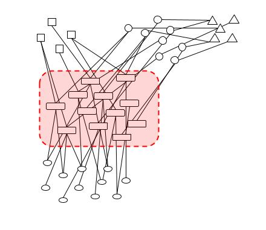

## Descrição

Este repositório possui a implementação de minha dissertação de Mestrado em Informática (Inteligência Artificial) pela Universidade de Brasília, realizado em 2019-2022, sobre o tópico **Efeitos do coarsening na classificação de grafos k-partidos**.
A branch `dissertacao` contém o exato código ao final do trabalho, e a branch `master` a versão mais atual com posteriores evoluções.
O objetivo deste repositório é, além de servir como histórico do trabalho, permitir que:
  - Os resultados encontrados sejam reproduzidos
  - Novos resultados sejam extraídos da ferramenta, permitindo que os resultados sejam extendidos para diferentes configurações de problemas reais
  - Servir como base para futuros trabalhos na área de Coarsening em Grafos K-Partidos

Para isso, abaixo estão apresentados os passos de instalação e uso do código.

A ideia central do algoritmo consiste em, dado um grafo k-partido onde se possui uma partição a qual se deseja classificar, utilizar dados de rótulos conhecidos nesta partição para guiar a redução, por coarsening, da quantidade de vértices e conexões. Como os métodos de classificação em grafos possuem complexidade normalmente associada ao número de vértices e arestas, a intenção deste procedimento é reduzir a necessidade de memória para armazenar as representações dos grafos e ainda possibilitar a redução no tempo de execução da classificação, e assim poder averiguar os impactos na qualidade dos resultados.


## Referência

>[1] Texto da dissertação: Althoff, Paulo E. e Faleiros, Thiago P.; Efeitos do coarsening na classificação de grafos k-partidos, Universidade de Brasília (UnB), 2022

>[2] Vídeo da defesa: _____


```
Aviso
-------
A implementação relativa aos resultados encontrados no documento referenciado está na branch `dissertacao`
A versão na branch `master` possui evoluções e está em desenvolvimento
```


## Preparação
### Pré-requisitos

- Python `3.9.7`
- Anaconda `3-2011.11-Linux-x86_64`
- Projetos clonados:
  - [Este projeto](https://github.com/pealthoff/CoarseKlass)
  - [BNOC](https://github.com/alanvalejo/bnoc)
  - [pynetviewer](https://github.com/alanvalejo/pynetviewer)


### Instalação

- A lista de pacotes python utilizada está no arquivo `requiremets.txt`, na raiz deste projeto
- Recomenda-se o uso da ferramenta Anaconda para gerenciamento dos mesmos.
  - O ambiente pode ser recriado usando o `Anaconda3-2011.11-Linux-x86_64` com o comando:
    - `conda create --name <env> --file requirements.txt` 
  - O código também foi testado em máquinas Windows instalando-se pacote a pacote descrito no mencionado arquivo.

### Configuração

- Os 3 projetos listados em [Pré-requisitos](https://github.com/pealthoff/CoarseKlass#pr%C3%A9-requisitos) devem ser clonados em uma mesma pasta
- O ambiente descrito em [Instalação](https://github.com/pealthoff/CoarseKlass#instala%C3%A7%C3%A3o) adiciona todos os pacotes necessários para os 3 projetos
- 3 diretórios devem ser adicionados na mesma pasta para onde os projetos foram clonados
  - input - É o diretório que irá conter os descritores das configurações de grafos
  - graphs - É o diretório que irá conter os arquivos dos grafos já gerados, com seus nós, arestas e classificações "corretas"
  - output - Neste diretório as métricas das classificações serão salvas, além dos gráficos gerados

## Uso

### Geração de grafos

A geração de grafos é realizada usando a ferramenta HNOC `(Valejo, et al., A benchmarking tool for the generation of bipartite network models with overlapping communities, in Knowledge and information systems, vol. 62, p. 1641-1669, 2019, doi: https://doi.org/10.1007/s10115-019-01411-9)` os parâmetros possíveis são descritos em seu repositório [BNOC](https://github.com/alanvalejo/bnoc).

Para os experimentos descritos mais abaixo, além dos parâmetros de diretórios, os parâmetros específicos para geração de grafos utilizados foram:


| Opção              | Formato                      | Default                  | Descrição                                                     |
| ------------------ | ---------------------------- | ------------------------ | ------------------------------------------------------------- |
| -v, --vertices     | int array                    | [10, 10, 10]             | número de vértices apra cada partição                         |
| -d, --dispersion   | float array                  | [0.3, 0.3, 0.3]          | parâmetro de controle da esparsidade dos grafos gerados       |
| -c, --communities  | int array                    | [2, 2, 2]                | número de comunidades/classificações possíveis para os nós    |
| -e, --scheme       | int array of array           | [[0, 1], [1,2]]          | esquema do grafo                                              |
| -n, --noise        | float array                  | [0.1, 0.1]               | nível de ruído do grafo (controle o número de arestas inter-comounitárias)  |

Para realizar a geração de um grafo sintético, executar o comando:

```
$ python bnoc/bnoc/bnoc.py [opções]
```

### Coarsening + Classificação

O Coarsening e a classificação executada nos diversos níveis é executada pelo mesmo código, descrito no arquivo `exp.py`, na raiz deste projeto.
Os parâmetros possíveis estão descritos no arquivo `args/coarseklass.json`, deste projeto, destacando os seguintes parâmetros:


| Opção              | Formato                      | Default                  | Descrição                                                     |
| ------------------ | ---------------------------- | ------------------------ | ------------------------------------------------------------- |
| -m, --max_levels   | int array                    | [3, 3]                   | número de etapas de coarsening para cada partição             |
|      --max_size    | float array                  | [1, 1]                   | número mínimo de vértices permitido para cada partição após as reduções     |
| -r, --reduction_factor  | float/float array       | 0.2                      | redução alvo em cada etapa do coarsening    |
| -mtr, --metrics    | string array                 | ["accuracy"]             | tipos de métricas a serem coletadas após a classificação  |

Outros parâmetros como amostragem utilizada ainda são alteradas diretamente no código, e virarão parâmetros de linha de comando em futura versão.

Para realizar um teste de coarsening/classificação de um grafo sintético, executar o comando:

```
$ python CoarseKlass/exp.py -cnf [opções]
```

Uma alternativa ao uso de parâmetros de linha de comando é o uso de um arquivo `.json` descrevendo os parâmetros, que pode ser passado pela opção:

| Opção              | Formato                      | Default                  | Descrição                                                     |
| ------------------ | ---------------------------- | ------------------------ | ------------------------------------------------------------- |
| -cnf, --conf       | string (path para o arquivo) | ---                      | número de etapas de coarsening para cada partição             |

Para realizar um teste usando este arquivo, executar o comando:

```
$ python CoarseKlass/exp.py -cnf [arquivo descritor do grafo]
```

### Experimentos

Para facilitar os experimentos, foi criado um código auxiliar em `exp_loop.py`, esse arquivo realiza um loop aninhando variações dos diferentes parâmetros descritos na tabela mais abaixo, com todos os procedimentos (controlados pelo parâmetro `mode`) de:
  - Métricas de controle de experimentos faltantes (`control`)
  - Geração dos descritores de grafos (`conf`)
  - A geração dos grafos usando o HNOC (`graph`)
  - Coarsening e classificação dos grafos (`class`)
  - Condensação das métricas para avaliações e geração de gráficos (`metrics`)
   
Parâmetros de controle dos loops aninhados:

| Opção                   | Formato                      | Default                  | Descrição                                                     |
| ----------------------- | ---------------------------- | ------------------------ | ------------------------------------------------------------- |
| -m, --mode              | string ["control", "conf", "graph", "class", "metrics"] | ---             | modo do loop             |
| -n, --noise             | float                        | range [0.1, 1] step 0.1         | nível de noise, se não passado é usado todo o range default    |
| -d, --dispersion        | float                        | range [0.1, 1] step 0.1            | nível de dispersion, se não passado é usado todo o range default  |
| -ds, --dispersion_step  | float                      | 0.1                      | alternativa ao parâmetro acima, para se definir um range em conjunto com os parâmetros `mnd` e `mxd` |
| -mnd, --min_dispersion  | float                  | 0.1                      | dispersão mínima do range  |
| -mxd, --max_dispersion  | float                 | 1                        | dispersão máxima do range  |
| -c, --communities       | int                 | range [4, 10] step 1           | número de classificações possíveis na partição alvo       |
| -cs, --communities_step | int                          | 1                        | alternativa ao parâmetro acima, para se definir um range em conjunto com os parâmetro `mxc`, m
inimo fixo em 4|
| -mxc, --max_communities | int                | 10                       | número de classificações máxima do range  |
| -v, --vertices          | int                 | range [100, 1000] step 100            | número de vértices na partição alvo do grafo, com partições auxiliares de tamanho 5x maior  |
| -mxv, --max_vertices    | int                 | 1000             | tipos de métricas a serem coletadas após a classificação  |
| -s, --schema            | string                 | id de esquema a ser definido no arquivo `exp_loop.py`             | tipos de métricas a serem coletadas após a classificação  |
| -dir, --directory       | string                 | ------             | path do diretório contendo os [3 projetos clonados](https://github.com/pealthoff/CoarseKlass#pr%C3%A9-requisitos)  |
| -itr, --iterations      | int                   | ["accuracy"]             | número de grafos distintos gerados para cada configuração  |

#### Geração dos descritores

A geração dos descritores consiste em gerar arquivos .json que contém as configurações dos grafos a serem carregadas pelo BNOC e pelo procedimento de Coarsening. Os arquivos gerados vão para a pasta `input`.
Para realizar a geração dos arquivos usando o loop descrito mais acima:

```
$ CoarseKlass\exp_loop.py -m conf [opções]
```


#### Geração dos grafos

A geração dos grafos usa os arquivos do passo anterior para alimentar o BNOC na geração dos grafos. Os arquivos gerados vão para a pasta `graphs`.
Para realizar a geração dos grafos usando o loop descrito mais acima:

```
$ CoarseKlass\exp_loop.py -m class [opções]
```

#### Coarsening e classificação

Usando os descritores dos grafos na pasta `input` e arquivos dos grafos na pasta `graphs` como entrada, são realizados os procedimentos de coarsening e classificação dos grafos em suas versões originais e reduzidas. As métricas geradas vão para a pasta `output/metrics`
Para realizar o procedimento usando o loop descrito mais acima:

```
$ CoarseKlass\exp_loop.py -m class [opções]
```

#### Geração de métricas

Para condensar os arquivos de métricas gerados, com o fim de usá-los em análises e geração de grafos, pode-se usar o comando abaixo:

```
$ CoarseKlass\exp_loop.py -m metrics [opções]
```

Os dados são gerados na mesma pasta das métricas `output/metrics`.


### Exemplos

#### Exemplo básico

Como exemplo, vamos gerar um teste executado com um grafo que possua os eguinte esquema:



Para isso, defina em `exp_loop.py` o descritor do esquema:
```
schemas = {
    'exemplo': {
        'layers': 4,
        'schema': [
            [0, 1],
            [0, 2],
            [0, 3],
            [3, 4]
        ],
    },
```

Vamos fazer a geração de 10 grafos com noise 0.1 e dispersão 0.2, 4 classificações possíveis e 2100 vértices (100 na partição alvo e 500 nas auxiliares):

```
$ CoarseKlass/exp_loop.py -m conf -s exemplo1 -itr 1 -n 0.1 -d 0.2 -c 4 -v 100 -dir [path da pasta acima dos 3 projetos]
$ CoarseKlass/exp_loop.py -m graph -s exemplo1 -itr 1 -n 0.1 -d 0.2 -c 4 -v 100 -dir [path da pasta acima dos 3 projetos]
$ CoarseKlass/exp_loop.py -m class -s exemplo1 -itr 1 -n 0.1 -d 0.2 -c 4 -v 100 -dir [path da pasta acima dos 3 projetos]
$ CoarseKlass/exp_loop.py -m metrics -s exemplo1 -itr 1 -n 0.1 -d 0.2 -c 4 -v 100 -dir [path da pasta acima dos 3 projetos]
```

Para geração de gráficos, o arquivo auxiliar `___` está disponibilizado na raiz deste projeto, mas sua configuração deve ser feita no código, pois a interpretação de parâmetros ainda não foi finalizada.


#### Experimento 1 da dissertação

O experimento 1 da dissertação usa os parâmetros default do código. Portanto bastaria a execução do mesmos em a passagem de parâmetros.
Mas **ATENÇÃO** o loop do `exp_loop.py` é síncrono, logo a simples execução demoraria um tempo muito elevado. Como cada loop é executado em única thread, recomenda-se o uso de um loop em bash que dispare o número de processadores disponíveis na máquina. Atentar também para o consumo de memória na distribuição do loop, já que grafos com maior número de vértices ocupam uma memória secundária considerável.

- Nos experimentos da dissertação foi utilizada uma máquina de 192GB de RAM e 96 núcleos.
- A divisão do processamento foi feita disparando 50 comandos por vez, divididos de forma linear com o crescimento do número de classes e de vértices.

#### Experimento 2 da dissertação

Com os mesmos cuidados do Experimento 1 na divisão do processamento, o experimento 2 pode ser realizado da mesma forma incluindo os parâmetros:

- `n = 0.3`
- `mxv = 5000`
- `itr =`
  - `10 if 21 * v < 10000`
  - `5 if 21 * v < 60000`
  - `3 else`

#### Experimento com dados do DBLP

Os descritores do banco DBLP usado no experimento com dados reais estão disponíveis neste [link](https://drive.google.com/file/d/1ZtO0DIVtVgnRC6Zma29g9kevosaPhCzo/view?usp=sharing). Para realizar este experimento, basta extrair este arquivo na pasta `input` e executar:

```
$ CoarseKlass/exp.py cnf [path da pasta acima dos 3 projetos]/APCT.json
```

### Versionamento

Hoje o projeto contém duas versões:
  - a tag `dissertacao` corresponde a exata versão usada em [1](https://github.com/pealthoff/CoarseKlass/edit/master/README.md#refer%C3%AAncia), para replicação dos resultados
  - a branch `master` contém o código mais atual conforme os procedimentos são otimizados e está em desenvolvimento


## Bugs

- Se forem encontrados problemas na execução dos procedimentos aqui descritos ou na instalação do ambiente, por favor contate o autor:
- **Contato**:
  - Paulo Eduardo Althoff
  - pealthoff@gmail.com

## Créditos e Licenças

- Caso use este código, por favor referencie o trabalho referenciado [1](https://github.com/pealthoff/CoarseKlass/edit/master/README.md#refer%C3%AAncia)
- [Licença Pública Geral GNU v3.0](https://www.gnu.org/licenses/gpl-3.0.pt-br.html)


<div class="footer"> &copy; Copyright (C) 2022 Paulo Eduardo Althoff &lt;pealthoff@gmail.com&gt; All rights reserved.</div>
